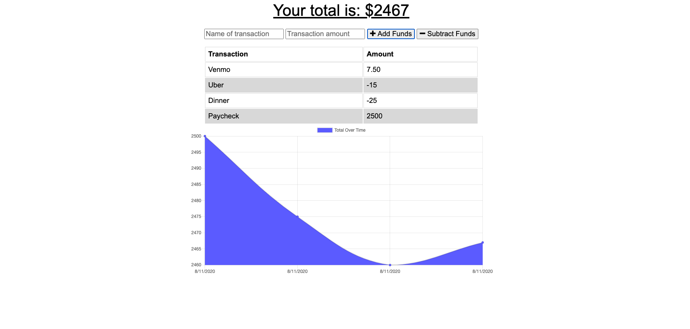

# Online/Offline Budget Trackers

The Budget Tracker application allows for offline access and functionality so that the user will be able to add expenses and deposits to their budget with or without a connection. When entering transactions offline, the transactions will populate the total when brought back online.

The application is deployed [here](https://offlinebudgettrackerapp.herokuapp.com/) on Heroku.



Offline Functionality:

  * Enter deposits offline

  * Enter expenses offline

When brought back online:

  * Offline entries are added to tracker.

## User Story
```
AS AN avid traveller
I WANT to be able to track my withdrawals and deposits with or without a data/internet connection
SO THAT my account balance is accurate when I am traveling
```

## Business Context

Giving users a fast and easy way to track their money is important, but allowing them to access that information anytime is even more important. Having offline functionality is paramount to the applications success.

# Table of Contents
[Installation](#installation)

[Usage](#usage)

[Questions](#questions)

# Installation
** Prior to installation, the user should have MongoDB installed **

Once the repository has been forked and cloned, the user will need to run the command ```npm install``` to retrieve the neccessary dependecies.

# Usage

Following installation, the user will run ```npm start``` to initialize the server.

In the server, the user can interact with the application to log transactions and track their budget. 


# Questions

Github username: @Jacquelineadean

Github URL: [GitHub](https://github.com/jacquelineadean/)

LinkedIn: [LinkedIn](https://www.linkedin.com/in/jacqueline-dean-968a66150/)

Email: Jacquelineadean@gmail.com


